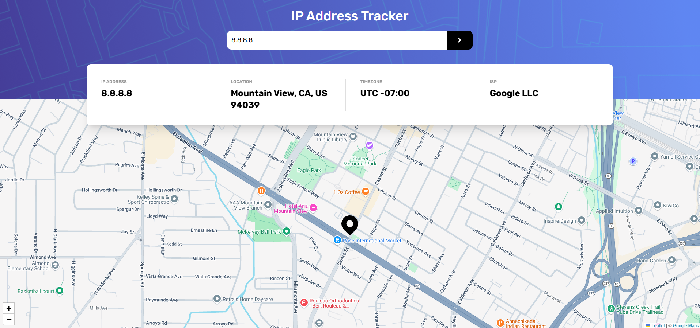

# IP Address Tracker



A responsive IP address tracker built with modern web technologies. Enter any IP address or domain to fetch and visualise its geolocation data on an interactive map.

This project was insipired by the [Frontend Mentor IP Address Tracker challenge](https://www.frontendmentor.io/challenges/ip-address-tracker-I8-0yYAH0).

## Features

- Search for any valid **IPv4** or **IPv6** Address
- View real-time location on an interactive **Google Map integreated with Leaflet**
- **Detailed data**: IP, location, timezone, and ISP
- Fast and responsive UI with **Tailwind CSS**
- Global state management with **Redux**
- Powered by the **IPWhoIs API**

## Tech Stack

- **[React](https://react.dev/)** - UI Library
- **[TypeScript](https://www.typescriptlang.org/)** - Type-safe JavaScript
- **[Tailwind CSS](https://tailwindcss.com/)** - CSS framework
- **[Axios](https://axios-http.com/)** - HTTP client
- **[Redux](https://redux.js.org/)** - Global state management
- **[Leaflet](https://leafletjs.com/)** - Interactive maps
- **[IPWhoIs API](https://ipwhois.io/)** - IP geolocation data

## Installation

1. **Clone this repo:**

   ```bash
   git clone https://github.com/TerenceCLZhang/ip-address-tracker.git
   cd ip-address-tracker
   ```

2. **Install dependencies:**

   Using npm:

   ```bash
   npm install
   ```

   Or using yarn:

   ```bash
   yarn install
   ```

3. **Start the development server:**

   Using npm:

   ```bash
   npm run dev
   ```

   Or using yarn:

   ```bash
   yarn run
   ```

## Contributions

This is a personal project created to showcase my skills. I am not accepting contributions at this time. However, I am open to suggestions, which you can make via the [Disucssions tab](https://github.com/TerenceCLZhang/ip-address-tracker/discussions) or my Frontend Mentor submission page.

## License

This project is released under the [MIT license](LICENSE). You are free to use, modify, and distribute this project in accordance with the terms of the license.
